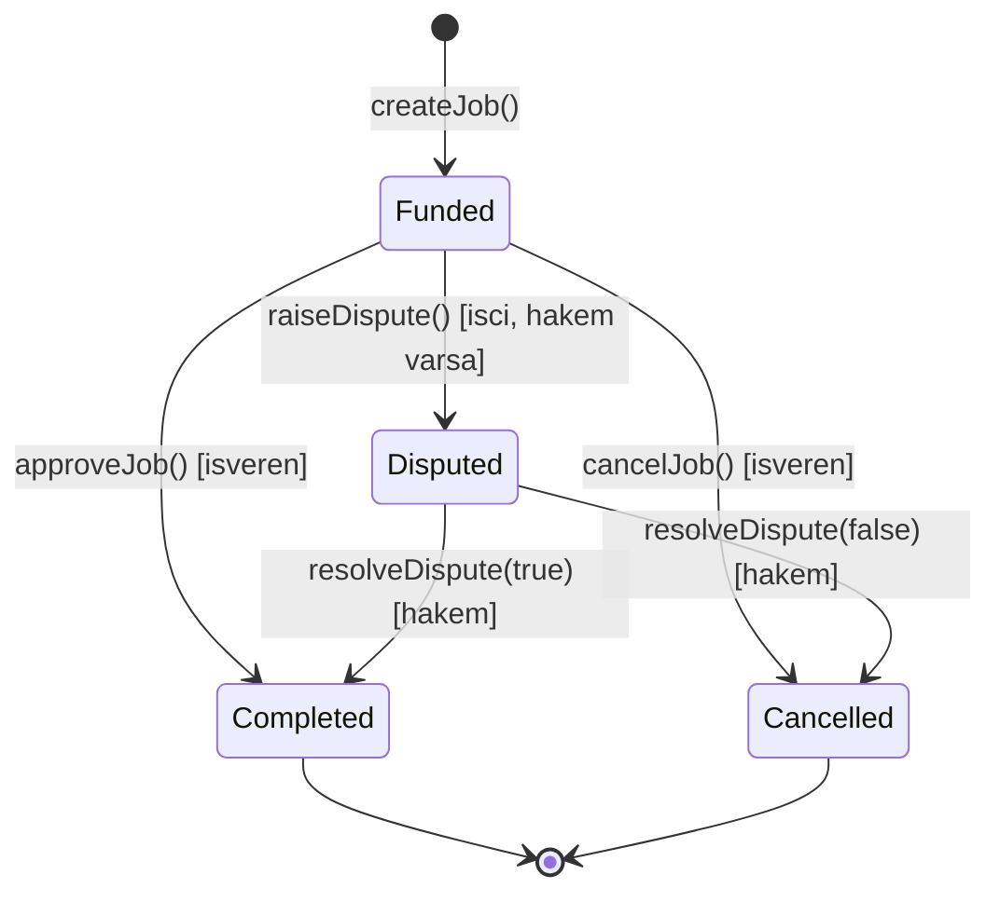
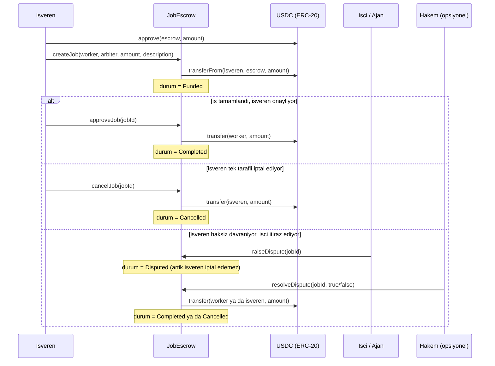

# Arc Agent Escrow

[](https://github.com/negroni334/arc-agent-escrow/actions/workflows/test.yml)
[](LICENSE)

Arc Testnet uzerinde calisan, USDC tabanli basit bir AI Agent / is emaneti (escrow) sistemi.

Isveren bir ise USDC kilitler; is tamamlaninca isveren onaylar ve USDC otomatik olarak
ajan/isci cuzdanina gecer. Isveren, onaydan once isi iptal edip parasini geri alabilir.
Her job'a opsiyonel bir **hakem (arbiter)** atanabilir: isveren haksiz davranip onaylamazsa,
isci anlasmazlik acabilir ve karari tarafsiz hakem verir — boylece isveren tek tarafli
olarak isi yaptirip parayi geri alamaz.

**Canli demo (dApp):** [arc-agent-escrow.vercel.app](https://arc-agent-escrow.vercel.app)
— MetaMask ile baglan, is olustur/onayla/iptal et, tumu gercek Arc Testnet uzerinde.

## Mimari

### Is durumlari (state machine)



### Akis



## Ag Bilgileri (Arc Testnet)

| | |
|---|---|
| Chain ID | `5042002` |
| RPC | `https://rpc.testnet.arc.network` |
| Explorer | `https://testnet.arcscan.app` |
| USDC (ERC-20 arayuzu, 6 decimal) | `0x3600000000000000000000000000000000000000` |

## Deploy Edilmis Kontrat

| | |
|---|---|
| `JobEscrow` | [`0x2E884D26978EA9120ba21445abe1f7Fd8144a114`](https://testnet.arcscan.app/address/0x2E884D26978EA9120ba21445abe1f7Fd8144a114) (Arcscan'de dogrulanmis ✅) |

## Kurulum

```bash
foundryup
forge install
cp .env.example .env   # sonra .env icini kendi degerlerinle doldur
```

## Test

```bash
forge test -vvv
```

## Deploy (Arc Testnet)

```bash
forge script script/Deploy.s.sol --rpc-url arc_testnet --broadcast
```

## Frontend (dApp)

`frontend/` klasorunde, ek bir build araci gerektirmeyen (vanilla HTML/CSS/JS + ethers.js v6)
basit bir arayuz var. MetaMask ile baglanip is olusturma/onaylama/iptal etme islemlerini
tarayicidan yapmayi sagliyor; canli hali [arc-agent-escrow.vercel.app](https://arc-agent-escrow.vercel.app).

Local'de calistirmak icin:

```bash
node frontend/serve.js
# http://localhost:5173
```

## Kontrat Arayuzu

- `createJob(address worker, address arbiter, uint256 amount, string description) -> uint256 jobId`
  Isveren once USDC'ye `approve(escrowAdresi, amount)` cagirmis olmali. Bu fonksiyon
  parayi `transferFrom` ile kontrata ceker ve isi "Funded" durumuna alir. `arbiter` icin
  `address(0)` verilirse hakem atanmamis olur (isci bu job icin anlasmazlik acamaz).
- `approveJob(uint256 jobId)` — sadece isveren cagirabilir, is "Funded" ise. Isi
  "Completed" yapar, kilitli USDC'yi worker'a gonderir.
- `cancelJob(uint256 jobId)` — sadece isveren cagirabilir, is hala "Funded" ise. Isi
  "Cancelled" yapar, kilitli USDC'yi isverene iade eder. Is "Disputed" durumuna
  gectiyse artik cagrilamaz.
- `raiseDispute(uint256 jobId)` — sadece isci cagirabilir, is "Funded" ve job'a bir
  hakem atanmis olmali. Isi "Disputed" yapar; bu noktadan sonra isveren iptal edemez.
- `resolveDispute(uint256 jobId, bool releaseToWorker)` — sadece job'a atanmis hakem
  cagirabilir, is "Disputed" ise. `true` ise USDC isciye (Completed), `false` ise
  isverene (Cancelled) gider.
- `getJob(uint256 jobId)` — is detaylarini okur (view).

## Guven Modeli / Kapsam Disi

- Onay (`approveJob`) ve iptal (`cancelJob`) varsayilan olarak isverenin elinde. Opsiyonel
  hakem mekanizmasi, isverenin isi yaptirip haksiz yere iptal etmesine karsi iscinin
  savunmasidir — ama hakem atanmasi zorunlu degil, atanmazsa eski (tamamen guvene dayali)
  davranis gecerli olur.
- Hakem, is olusturulurken isveren tarafindan seçiliyor; iki tarafin da guvendigi tarafsiz
  bir adres olmali. Hakemin kendisi kotu niyetli olursa bu koruma islemez — bu MVP'nin
  bilinen bir siniri.
- Kismi odeme, coklu-hakem/oylama, deadline/timeout mekanizmasi bu surumde yok —
  ileride eklenebilecek genisletmeler olarak dusunulmeli.
- `.env` dosyasi asla commit edilmez (`.gitignore`'da). Icindeki private key sadece
  testnet icin uretilmis, gercek fonu olmayan bir cuzdana ait.
