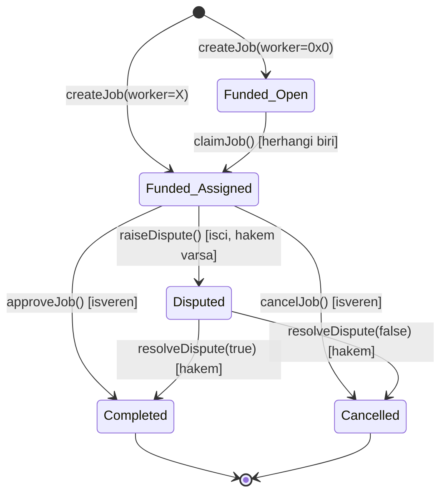
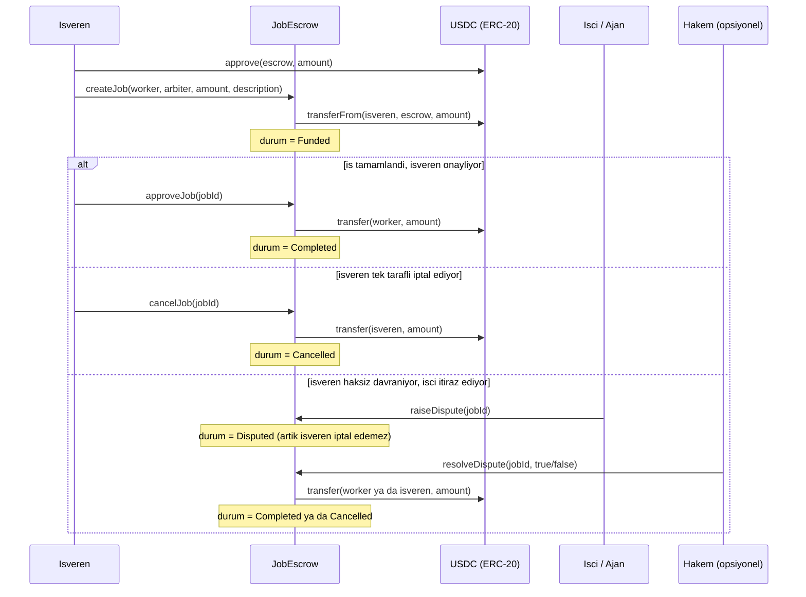

# Arc Agent Escrow

[](https://github.com/negroni334/arc-agent-escrow/actions/workflows/test.yml)
[](LICENSE)

Arc Testnet uzerinde calisan, USDC tabanli basit bir AI Agent / is emaneti (escrow) sistemi.

Isveren bir ise USDC kilitler; is tamamlaninca isveren onaylar ve USDC otomatik olarak
ajan/isci cuzdanina gecer. Isveren, onaydan once isi iptal edip parasini geri alabilir.
Her job'a opsiyonel bir **hakem (arbiter)** atanabilir: isveren haksiz davranip onaylamazsa,
isci anlasmazlik acabilir ve karari tarafsiz hakem verir — boylece isveren tek tarafli
olarak isi yaptirip parayi geri alamaz.

Is, belirli bir isciye atanabilir **ya da worker bos birakilip "acik is" olarak** yayinlanabilir
— bu durumda herhangi bir adres (insan ya da ajan) `claimJob` ile isi ustlenebilir, basit
bir is pazari (marketplace) olusturur. Her adresin gecmisi (`JobApproved`/`JobCancelled`
event'lerinden turetilen tamamlanan/iptal edilen is sayisi) hem dApp'te hem SDK'da goruntulenir.
Ayrica [`agent-sdk/`](agent-sdk/) altinda, iki otonom cuzdanin **hicbir insan mudahalesi
olmadan** gercek bir is-odeme dongusu tamamladigi calisan bir Node.js demosu var.

**Canli demo (dApp):** [arc-agent-escrow.vercel.app](https://arc-agent-escrow.vercel.app)
— MetaMask ile baglan, is olustur/onayla/iptal et, tumu gercek Arc Testnet uzerinde.

## Mimari

### Is durumlari (state machine)



(`Funded_Open` ve `Funded_Assigned`, kontratin `Status` enum'unda tek bir "Funded" degeri —
worker alaninin `address(0)` olup olmamasi acik/atanmis ayrimini yapar.)

### Akis



## Ag Bilgileri (Arc Testnet)

| | |
|---|---|
| Chain ID | `5042002` |
| RPC | `https://rpc.testnet.arc.network` |
| Explorer | `https://testnet.arcscan.app` |
| USDC (ERC-20 arayuzu, 6 decimal) | `0x3600000000000000000000000000000000000000` |

## Deploy Edilmis Kontrat

| | |
|---|---|
| `JobEscrow` (v3 — acik is pazari) | [`0xCc63109fE7A09C886b8145E31bA65e1bA9EB9448`](https://testnet.arcscan.app/address/0xCc63109fE7A09C886b8145E31bA65e1bA9EB9448) (Arcscan'de dogrulanmis ✅) |
| `Faucet` | [`0x01d7a0085C5fbb28062F80e117903356ee397a29`](https://testnet.arcscan.app/address/0x01d7a0085C5fbb28062F80e117903356ee397a29) (Arcscan'de dogrulanmis ✅) |

<details>
<summary>Onceki deploylar (seffaflik icin, kullanimda degil)</summary>

| Surum | Adres | Not |
|---|---|---|
| v2 | [`0x2E884D26978EA9120ba21445abe1f7Fd8144a114`](https://testnet.arcscan.app/address/0x2E884D26978EA9120ba21445abe1f7Fd8144a114) | Hakem/dispute mekanizmasi eklendi |
| v1 | [`0x662B6eC9cc4fD8023806d95fCB9958c9794453cB`](https://testnet.arcscan.app/address/0x662B6eC9cc4fD8023806d95fCB9958c9794453cB) | Ilk MVP (create/approve/cancel) |

</details>

## Kurulum

```bash
foundryup
forge install
cp .env.example .env   # sonra .env icini kendi degerlerinle doldur
```

## Test

```bash
forge test -vvv
```

## Deploy (Arc Testnet)

```bash
forge script script/Deploy.s.sol --rpc-url arc_testnet --broadcast

# Faucet'i deploy et (havuzu doldurmak istersen FAUCET_FUND_AMOUNT'i ayarla, orn. 5000000 = 5 USDC)
forge script script/DeployFaucet.s.sol --rpc-url arc_testnet --broadcast
```

> Not: `DeployFaucet.s.sol` icindeki `fund()` cagrisi, Foundry'nin yerel simulasyonunun
> Arc'in USDC compliance/blocklist kontrolunu dogru simule edememesi nedeniyle bazen
> "StackUnderflow" hatasi verebilir. Boyle olursa deploy ve fonlamayi ayri adimlarda yap:
> once `FAUCET_FUND_AMOUNT` olmadan deploy et, sonra `cast send` ile `approve` + `fund`
> cagir (gercek zincirde sorunsuz calisir, sadece yerel simulasyon etkileniyor).

## Mini Faucet

`src/Faucet.sol`, dApp'i denemek isteyenler icin kucuk, rate-limitli (adres basina gunde
0.5 USDC) bir USDC dagitici. Otomatik Circle faucet claim'i yapmaz — sahip tarafindan elle
doldurulan bir havuzdan dagitir; kotuye kullanimi onlemek icin cooldown tamamen zincir
uzerinde tutulur (`lastClaimedAt` mapping'i, herkes tarafindan denetlenebilir). Private key
gerektiren bir backend yok - kullanici dogrudan kendi cuzdanindan `claim()` cagirir.

- `claim()` — cagiran adrese `CLAIM_AMOUNT` (0.5 USDC) gonderir, `COOLDOWN` (1 gun) dolmadan
  tekrar cagrilamaz.
- `fund(uint256 amount)` — havuza herkes USDC ekleyebilir (once `approve` gerekir).
- `timeUntilNextClaim(address)` — bir sonraki claim'e kadar kalan saniye (view).
- `emergencyWithdraw(uint256 amount)` — sadece sahip (owner), havuzu geri ceker.

## Acik Is Pazari (Marketplace)

`createJob` cagrilirken `worker` alani `address(0)` birakilirsa is "acik" olusturulur —
belirli bir isciye onceden atanmamistir. Herhangi bir adres (insan ya da ajan) `claimJob(jobId)`
cagirarak isi ustlenebilir; bu noktadan sonra is normal (atanmis) bir is gibi davranir
(`approveJob`/`cancelJob`/`raiseDispute` ayni sekilde calisir). Bu, iki tarafin onceden
tanisik olmasi gerekmeden is bulusmasini saglayan basit bir pazar mekanizmasidir.

## Itibar (Reputation)

Kontrata hicbir ek alan/fonksiyon eklenmeden — tamamen mevcut `JobApproved` ve `JobCancelled`
event'lerinden turetilir. Frontend ve SDK, bir adresin gecmisini `queryFilter` ile zincirden
okuyup hesaplar: isveren olarak kac is tamamlanmis/iptal edilmis, isci olarak kac is
tamamlanmis. Ek altyapi (subgraph, backend, veritabani) gerektirmez; tamamen seffaf ve
herkes tarafindan bagimsiz dogrulanabilir. dApp'te her job card'inda ilgili adreslerin
yaninda kucuk bir rozet olarak gorunur.

## AI Agent SDK

[`agent-sdk/`](agent-sdk/) — Node.js'ten `JobEscrow` ile programatik etkilesim icin ince bir
`ArcEscrowClient` wrapper'i ve **otonom, iki cuzdanli bir demo** (`agent-sdk/examples/agent-demo.js`):
employer-agent acik bir is yayinlar, worker-agent kesfedip ustlenir, is yapilir (simule),
employer-agent onaylar — hepsi tek bir insan onayi olmadan, gercek Arc Testnet islemleriyle.
Detaylar icin [agent-sdk/README.md](agent-sdk/README.md).

## Frontend (dApp)

`frontend/` klasorunde, ek bir build araci gerektirmeyen (vanilla HTML/CSS/JS + ethers.js v6)
basit bir arayuz var. MetaMask ile baglanip is olusturma/onaylama/iptal etme islemlerini
tarayicidan yapmayi sagliyor; canli hali [arc-agent-escrow.vercel.app](https://arc-agent-escrow.vercel.app).

Local'de calistirmak icin:

```bash
node frontend/serve.js
# http://localhost:5173
```

## Kontrat Arayuzu

- `createJob(address worker, address arbiter, uint256 amount, string description) -> uint256 jobId`
  Isveren once USDC'ye `approve(escrowAdresi, amount)` cagirmis olmali. Bu fonksiyon
  parayi `transferFrom` ile kontrata ceker ve isi "Funded" durumuna alir. `arbiter` icin
  `address(0)` verilirse hakem atanmamis olur (isci bu job icin anlasmazlik acamaz).
  `worker` icin `address(0)` verilirse is "acik" olur (bkz. asagida).
- `claimJob(uint256 jobId)` — herhangi bir adres (isveren haric) cagirabilir; is "Funded"
  ve worker hala `address(0)` (yani acik) olmali. Cagiran adres yeni worker olur.
- `approveJob(uint256 jobId)` — sadece isveren cagirabilir, is "Funded" ise. Isi
  "Completed" yapar, kilitli USDC'yi worker'a gonderir.
- `cancelJob(uint256 jobId)` — sadece isveren cagirabilir, is hala "Funded" ise. Isi
  "Cancelled" yapar, kilitli USDC'yi isverene iade eder. Is "Disputed" durumuna
  gectiyse artik cagrilamaz.
- `raiseDispute(uint256 jobId)` — sadece isci cagirabilir, is "Funded" ve job'a bir
  hakem atanmis olmali. Isi "Disputed" yapar; bu noktadan sonra isveren iptal edemez.
- `resolveDispute(uint256 jobId, bool releaseToWorker)` — sadece job'a atanmis hakem
  cagirabilir, is "Disputed" ise. `true` ise USDC isciye (Completed), `false` ise
  isverene (Cancelled) gider.
- `getJob(uint256 jobId)` — is detaylarini okur (view).

## Guven Modeli / Kapsam Disi

- Onay (`approveJob`) ve iptal (`cancelJob`) varsayilan olarak isverenin elinde. Opsiyonel
  hakem mekanizmasi, isverenin isi yaptirip haksiz yere iptal etmesine karsi iscinin
  savunmasidir — ama hakem atanmasi zorunlu degil, atanmazsa eski (tamamen guvene dayali)
  davranis gecerli olur.
- Hakem, is olusturulurken isveren tarafindan seçiliyor; iki tarafin da guvendigi tarafsiz
  bir adres olmali. Hakemin kendisi kotu niyetli olursa bu koruma islemez — bu MVP'nin
  bilinen bir siniri.
- `claimJob` ilk gelen alir (first-come-first-served) mantigiyla calisir — birden fazla
  isci ayni acik ise basvurmak isterse, secim mekanizmasi (teklif/basvuru sistemi) yok.
- Kismi odeme, coklu-hakem/oylama, deadline/timeout mekanizmasi bu surumde yok —
  ileride eklenebilecek genisletmeler olarak dusunulmeli.
- `.env` dosyasi asla commit edilmez (`.gitignore`'da). Icindeki private key sadece
  testnet icin uretilmis, gercek fonu olmayan bir cuzdana ait.
