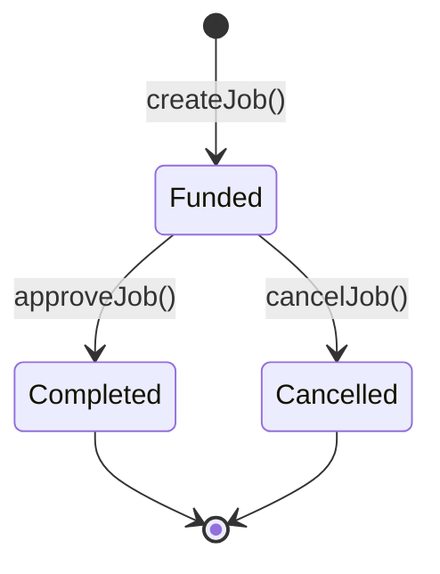
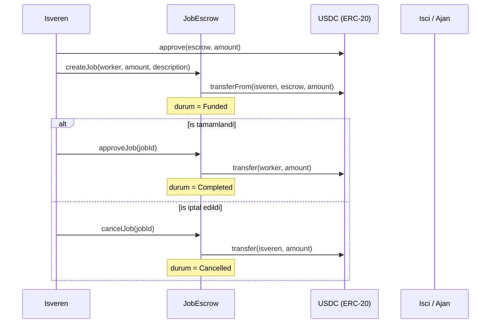

# Arc Agent Escrow

[](https://github.com/negroni334/arc-agent-escrow/actions/workflows/test.yml)
[](LICENSE)

Arc Testnet uzerinde calisan, USDC tabanli basit bir AI Agent / is emaneti (escrow) sistemi.

Isveren bir ise USDC kilitler; is tamamlaninca isveren onaylar ve USDC otomatik olarak
ajan/isci cuzdanina gecer. Isveren, onaydan once isi iptal edip parasini geri alabilir.

## Mimari

### Is durumlari (state machine)



### Akis



## Ag Bilgileri (Arc Testnet)

| | |
|---|---|
| Chain ID | `5042002` |
| RPC | `https://rpc.testnet.arc.network` |
| Explorer | `https://testnet.arcscan.app` |
| USDC (ERC-20 arayuzu, 6 decimal) | `0x3600000000000000000000000000000000000000` |

## Deploy Edilmis Kontrat

| | |
|---|---|
| `JobEscrow` | [`0x662B6eC9cc4fD8023806d95fCB9958c9794453cB`](https://testnet.arcscan.app/address/0x662B6eC9cc4fD8023806d95fCB9958c9794453cB) (Arcscan'de dogrulanmis ✅) |

## Kurulum

```bash
foundryup
forge install
cp .env.example .env   # sonra .env icini kendi degerlerinle doldur
```

## Test

```bash
forge test -vvv
```

## Deploy (Arc Testnet)

```bash
forge script script/Deploy.s.sol --rpc-url arc_testnet --broadcast
```

## Kontrat Arayuzu

- `createJob(address worker, uint256 amount, string description) -> uint256 jobId`
  Isveren once USDC'ye `approve(escrowAdresi, amount)` cagirmis olmali. Bu fonksiyon
  parayi `transferFrom` ile kontrata ceker ve isi "Funded" durumuna alir.
- `approveJob(uint256 jobId)` — sadece isveren cagirabilir. Isi "Completed" yapar,
  kilitli USDC'yi worker'a gonderir.
- `cancelJob(uint256 jobId)` — sadece isveren cagirabilir, is hala "Funded" ise. Isi
  "Cancelled" yapar, kilitli USDC'yi isverene iade eder.
- `getJob(uint256 jobId)` — is detaylarini okur (view).

## Guvenlik Notlari / Kapsam Disi

- MVP'de ayri bir hakem/arbiter rolu yok; onay tamamen isverenin imzasiyla yapilir.
- Anlasmazlik cozumu, kismi odeme, deadline/timeout mekanizmasi bu surumde yok —
  ileride eklenebilecek genisletmeler olarak dusunulmeli.
- `.env` dosyasi asla commit edilmez (`.gitignore`'da). Icindeki private key sadece
  testnet icin uretilmis, gercek fonu olmayan bir cuzdana ait.
